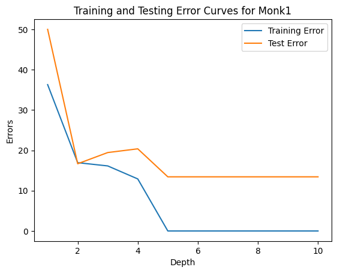
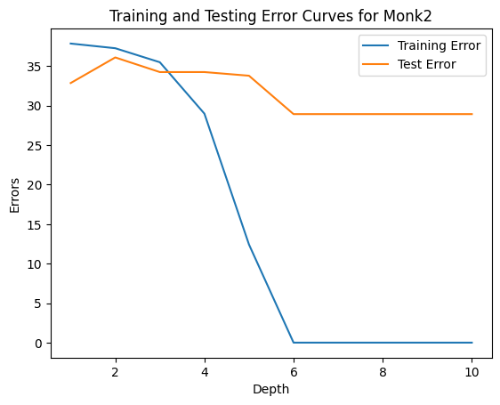
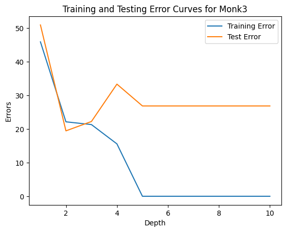
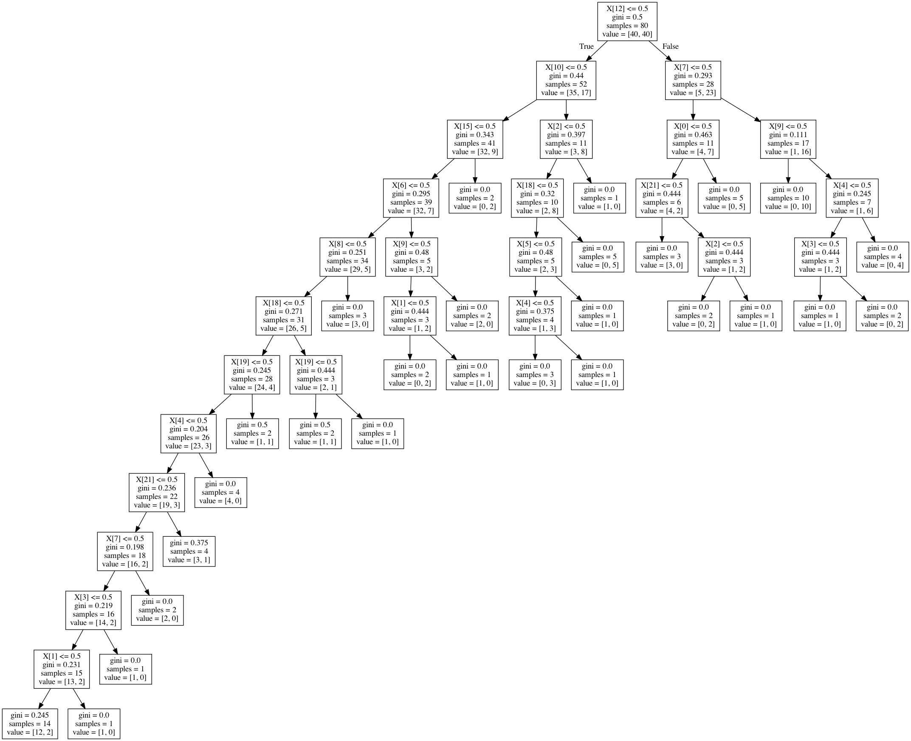

# decisionTree
An implementation of the ID3 algorithm for decision trees.

## Graphs on various data sets.

### Monks-1 data

### Monks-2 data

### Monks-3 data

### SPECT data

### Tree Generated by SciKit Learn on SPECT data

