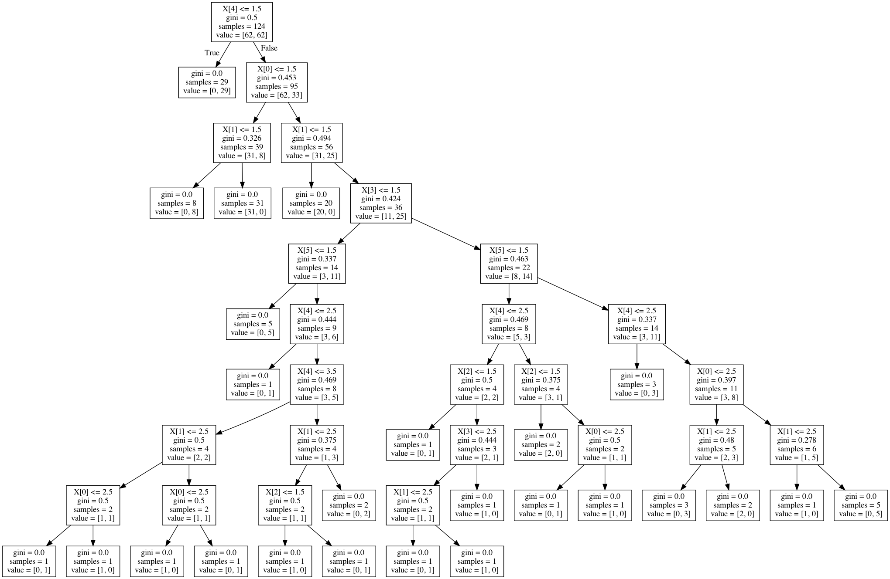
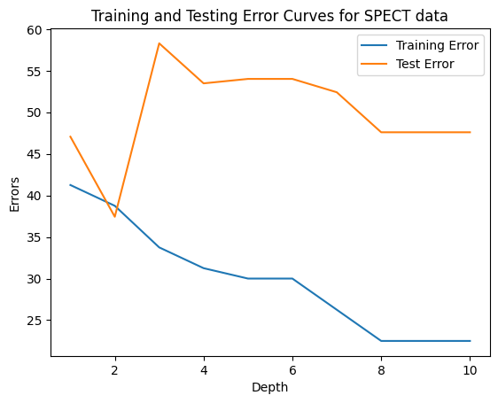

# decisionTree
An implementation of the ID3 algorithm for decision trees.

## Answers to questions (by parts)

### Part A
Plots of error vs tree depth

#### Monks-1 data


#### Monks-2 data


#### Monks-3 data


### Part B
Learned Decision Tree and Confusion Matrices for depths 1 and 2 on Monks1 data.

#### Decision Tree of Depth 1
```
Node value = None
 Feature f1{1, 2, 3}

	Node value = 1
	Label value = 0

	Node value = 2
	Label value = 1

	Node value = 3
	Label value = 1
```


#### The Confusion Matrix on the Training Set for Depth of  1 :
048 | 014  
031 | 031  
#### The Confusion Matrix on the Test Set for Depth of  1 :
144 | 072  
144 | 072  

#### Decision Tree of Depth 2
```
Node value = None
 Feature f1{1, 2, 3}

	Node value = 1
	 Feature f2{1, 2, 3}

		Node value = 1
		Label value = 1

		Node value = 2
		Label value = 0

		Node value = 3
		Label value = 0

	Node value = 2
	 Feature f2{1, 2, 3}

		Node value = 1
		Label value = 0

		Node value = 2
		Label value = 1

		Node value = 3
		Label value = 0

	Node value = 3
	 Feature f2{1, 2, 3}

		Node value = 1
		Label value = 0

		Node value = 2
		Label value = 0

		Node value = 3
		Label value = 1
```


#### The Confusion Matrix on the Training Set for Depth of  2 :
041 | 021  
000 | 062  
#### The Confusion Matrix on the Test Set for Depth of  2 :
144 | 072  
000 | 216  


###  Part C SciKit Learn's Decision tree for Monks1 data

#### Tree Generated by SciKit Learn on Monks data


#### Confusion Matrix for Monks-1 Using Scikit:

200 | 016  
036 | 180  

###  Part D Custom decisionTree and SciKit Learn's Decision tree for SPECT data

#### Plot of error vs tree depth (decisionTree class)


#### Decision Tree of Depth 1
```
Node value = None
 Feature f1{0, 1}

	Node value = 0
	Label value = 0

	Node value = 1
	Label value = 1
```

#### The Confusion Matrix on the Training Set for Depth of  1 :
018 | 022  
011 | 029  
#### The Confusion Matrix on the Test Set for Depth of  1 :
087 | 085  
003 | 012  

#### Decision Tree of Depth 2
```
Node value = None
 Feature f1{0, 1}

	Node value = 0
	 Feature f2{0, 1}

		Node value = 0
		Label value = 0

		Node value = 1
		Label value = 1

	Node value = 1
	 Feature f2{0, 1}

		Node value = 0
		Label value = 1

		Node value = 1
		Label value = 1
```

#### The Confusion Matrix on the Training Set for Depth of  2 :
022 | 018  
013 | 027  
#### The Confusion Matrix on the Test Set for Depth of  2 :
105 | 067  
003 | 012  


#### Tree Generated by SciKit Learn on SPECT data


#### Scikit Learn on SPECT Data, Confusion Matrix:
118 | 054  
003 | 012  
